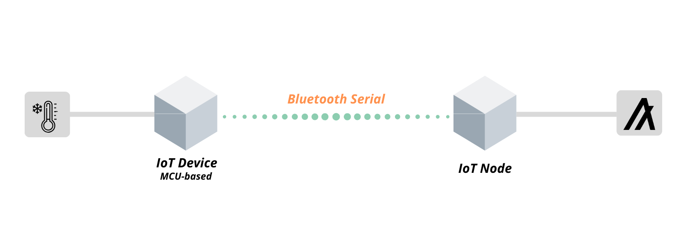

# algorand-iot-node

### To start off, follow this 3-step process.

1. Get the source code:

```
git clone https://github.com/TedNIVAN/algorand-iot-node.git
cd algorand-iot-node
npm i
```

2. Rename  **.env_sample** to  **.env** then set the variables:

```
SERIAL_DEVICE=/dev/cu.DSDTECHHC-05-DevB
SERIAL_SPEED=9600

NODE="https://testnet-algorand.api.purestake.io/ps1"
APIKEY=""
MN=""
```

3. Launch the Iot node:

```
node app.js
```


